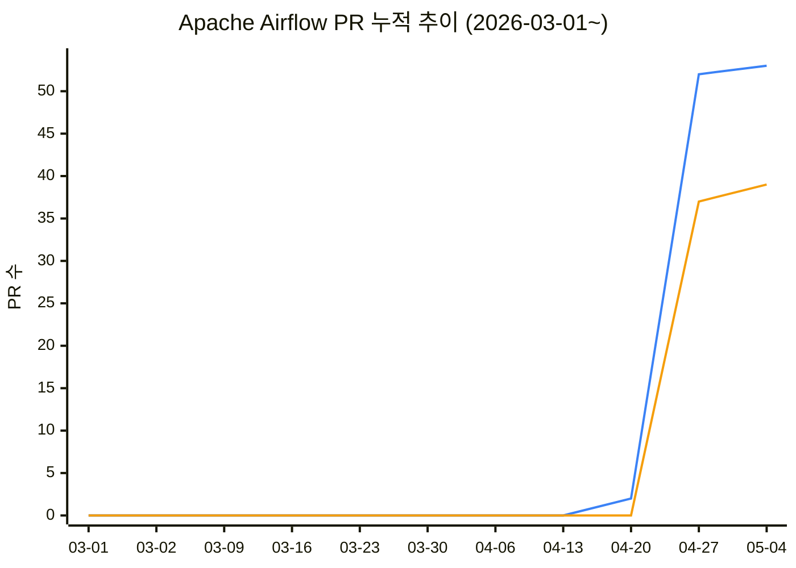

# ossca

오픈소스 컨트리뷰션 아카데미 아카이빙 저장소.

## 2026 Apache Airflow 멘티 PR 현황

- 표의 **작성 PR / 리뷰 PR** 숫자를 클릭하면 해당 멘티의 GitHub 검색 결과로 이동합니다.
- 각 팀의 **상세 PR 목록**을 펼치면 PR 제목·상태·생성일이 함께 표시됩니다. 상태: 🟢 open / 🟣 merged / 🔴 closed.

<!-- STATS:START -->

> 🔵 **작성 PR** · 🟠 **리뷰 PR** (매주 월요일 시점의 누계, 마지막 점은 오늘 시점)

_마지막 업데이트: 2026-05-04 22:04 UTC_

### Offline Team A

| 이름 | GitHub | 작성 PR | 리뷰 PR |
|------|--------|---------|---------|
| 구지민 | [@jimizip](https://github.com/jimizip) | [2](https://github.com/apache/airflow/pulls?q=repo%3Aapache/airflow%20is%3Apr%20author%3Ajimizip%20created%3A%3E%3D2026-04-22) | [0](https://github.com/apache/airflow/pulls?q=repo%3Aapache/airflow%20is%3Apr%20reviewed-by%3Ajimizip%20created%3A%3E%3D2026-04-22) |
| 사재혁 | [@JaeHyuckSa](https://github.com/JaeHyuckSa) | [0](https://github.com/apache/airflow/pulls?q=repo%3Aapache/airflow%20is%3Apr%20author%3AJaeHyuckSa%20created%3A%3E%3D2026-04-22) | [2](https://github.com/apache/airflow/pulls?q=repo%3Aapache/airflow%20is%3Apr%20reviewed-by%3AJaeHyuckSa%20created%3A%3E%3D2026-04-22) |
| 김수연 | [@kimsuyeon0916](https://github.com/kimsuyeon0916) | [3](https://github.com/apache/airflow/pulls?q=repo%3Aapache/airflow%20is%3Apr%20author%3Akimsuyeon0916%20created%3A%3E%3D2026-04-22) | [2](https://github.com/apache/airflow/pulls?q=repo%3Aapache/airflow%20is%3Apr%20reviewed-by%3Akimsuyeon0916%20created%3A%3E%3D2026-04-22) |
| 박호정 | [@Parkhojeong](https://github.com/Parkhojeong) | [19](https://github.com/apache/airflow/pulls?q=repo%3Aapache/airflow%20is%3Apr%20author%3AParkhojeong%20created%3A%3E%3D2026-04-22) | [20](https://github.com/apache/airflow/pulls?q=repo%3Aapache/airflow%20is%3Apr%20reviewed-by%3AParkhojeong%20created%3A%3E%3D2026-04-22) |
| 박진우 | [@jinoo7099](https://github.com/jinoo7099) | [1](https://github.com/apache/airflow/pulls?q=repo%3Aapache/airflow%20is%3Apr%20author%3Ajinoo7099%20created%3A%3E%3D2026-04-22) | [1](https://github.com/apache/airflow/pulls?q=repo%3Aapache/airflow%20is%3Apr%20reviewed-by%3Ajinoo7099%20created%3A%3E%3D2026-04-22) |
| 백다은 | [@nuebaek](https://github.com/nuebaek) | [1](https://github.com/apache/airflow/pulls?q=repo%3Aapache/airflow%20is%3Apr%20author%3Anuebaek%20created%3A%3E%3D2026-04-22) | [0](https://github.com/apache/airflow/pulls?q=repo%3Aapache/airflow%20is%3Apr%20reviewed-by%3Anuebaek%20created%3A%3E%3D2026-04-22) |
| 김태훈 | [@23tae](https://github.com/23tae) | [1](https://github.com/apache/airflow/pulls?q=repo%3Aapache/airflow%20is%3Apr%20author%3A23tae%20created%3A%3E%3D2026-04-22) | [0](https://github.com/apache/airflow/pulls?q=repo%3Aapache/airflow%20is%3Apr%20reviewed-by%3A23tae%20created%3A%3E%3D2026-04-22) |
| 김승규 | [@ed-kyu](https://github.com/ed-kyu) | [1](https://github.com/apache/airflow/pulls?q=repo%3Aapache/airflow%20is%3Apr%20author%3Aed-kyu%20created%3A%3E%3D2026-04-22) | [0](https://github.com/apache/airflow/pulls?q=repo%3Aapache/airflow%20is%3Apr%20reviewed-by%3Aed-kyu%20created%3A%3E%3D2026-04-22) |
| 민경도 | [@ggydo59](https://github.com/ggydo59) | [0](https://github.com/apache/airflow/pulls?q=repo%3Aapache/airflow%20is%3Apr%20author%3Aggydo59%20created%3A%3E%3D2026-04-22) | [0](https://github.com/apache/airflow/pulls?q=repo%3Aapache/airflow%20is%3Apr%20reviewed-by%3Aggydo59%20created%3A%3E%3D2026-04-22) |

Offline Team A 상세 PR 목록

#### 구지민 ([@jimizip](https://github.com/jimizip))

**작성한 PR**

- [#66346 i18n(Ko): add missing translations in common.json (May 4)](https://github.com/apache/airflow/pull/66346) — 🟣 merged (2026-05-04)
- [#66321 i18n(Ko): add missing translations in components.json (May 4)](https://github.com/apache/airflow/pull/66321) — 🔴 closed (2026-05-03)

**리뷰한 PR**

_없음_

#### 사재혁 ([@JaeHyuckSa](https://github.com/JaeHyuckSa))

**작성한 PR**

_없음_

**리뷰한 PR**

- [#66080 i18n(Ko): add missing translation in components.json (Apr 29)](https://github.com/apache/airflow/pull/66080) — 🟣 merged (2026-04-29)
- [#66078 i18n(Ko): translate no matches message](https://github.com/apache/airflow/pull/66078) — 🟣 merged (2026-04-29)

#### 김수연 ([@kimsuyeon0916](https://github.com/kimsuyeon0916))

**작성한 PR**

- [#66087 fix(ui): keep log controls visible during scrolling](https://github.com/apache/airflow/pull/66087) — 🔴 closed (2026-04-29)
- [#66078 i18n(Ko): translate no matches message](https://github.com/apache/airflow/pull/66078) — 🟣 merged (2026-04-29)
- [#66076 i18n(Ko): translate no matches message](https://github.com/apache/airflow/pull/66076) — 🔴 closed (2026-04-29)

**리뷰한 PR**

- [#66080 i18n(Ko): add missing translation in components.json (Apr 29)](https://github.com/apache/airflow/pull/66080) — 🟣 merged (2026-04-29)
- [#66079 i18n(Ko): add missing translations in dag.json](https://github.com/apache/airflow/pull/66079) — 🟣 merged (2026-04-29)

#### 박호정 ([@Parkhojeong](https://github.com/Parkhojeong))

**작성한 PR**

- [#66312 Align Dag terminology in CLI commands](https://github.com/apache/airflow/pull/66312) — 🟢 open (2026-05-03)
- [#66284 UI: fix Searchbar input rewind](https://github.com/apache/airflow/pull/66284) — 🟣 merged (2026-05-02)
- [#66221 UI: Fix manual copy from Rendered Templates tab adding extra blank lines](https://github.com/apache/airflow/pull/66221) — 🟣 merged (2026-05-01)
- [#66211 Align Dag capitalization from "DAG" to "Dag" in core_api](https://github.com/apache/airflow/pull/66211) — 🟣 merged (2026-05-01)
- [#66200 Align Dag capitalization from "DAG" to "Dag" for airflow-core/src/airflow/api/](https://github.com/apache/airflow/pull/66200) — 🟣 merged (2026-05-01)
- [#66163 i18n(ko): add missing translations(Apr 30)](https://github.com/apache/airflow/pull/66163) — 🟣 merged (2026-04-30)
- [#66155 Align Dag capitalization from "DAG" to "Dag" for providers/google/](https://github.com/apache/airflow/pull/66155) — 🟣 merged (2026-04-30)
- [#66153 Align Dag capitalization from "DAG" to "Dag" for providers/apache/](https://github.com/apache/airflow/pull/66153) — 🟣 merged (2026-04-30)
- [#66152 Align Dag capitalization from "DAG" to "Dag" for providers/amazon/](https://github.com/apache/airflow/pull/66152) — 🟣 merged (2026-04-30)
- [#66116 Align Dag capitalization from "DAG" to "Dag" for contributing-docs/](https://github.com/apache/airflow/pull/66116) — 🟣 merged (2026-04-29)
- [#66115 Align Dag capitalization from "DAG" to "Dag" for clients/](https://github.com/apache/airflow/pull/66115) — 🟣 merged (2026-04-29)
- [#66114 Align Dag capitalization from "DAG" to "Dag" for chart/](https://github.com/apache/airflow/pull/66114) — 🟣 merged (2026-04-29)
- [#66113 Align Dag capitalization from "DAG" to "Dag" for airflow-ctl-tests/](https://github.com/apache/airflow/pull/66113) — 🟣 merged (2026-04-29)
- [#66112 Align Dag capitalization from "DAG" to "Dag" for airflow-ctl/](https://github.com/apache/airflow/pull/66112) — 🟣 merged (2026-04-29)
- [#66109 Align Dag capitalization from "DAG" to "Dag" for airflow/](https://github.com/apache/airflow/pull/66109) — 🔴 closed (2026-04-29)
- [#66108 Align Dag capitalization from "DAG" to "Dag" for .github](https://github.com/apache/airflow/pull/66108) — 🟣 merged (2026-04-29)
- [#66099 Align Dag capitalization from "DAG" to "Dag" for api_fastapi](https://github.com/apache/airflow/pull/66099) — 🟣 merged (2026-04-29)
- [#66088 Align Dag capitalization from "DAG" to "Dag"](https://github.com/apache/airflow/pull/66088) — 🟣 merged (2026-04-29)
- [#66085 Align Dag capitalization from "DAG" to "Dag"](https://github.com/apache/airflow/pull/66085) — 🟣 merged (2026-04-29)

**리뷰한 PR**

- [#66370 Fix config lint warnings for remove_if_equals rules](https://github.com/apache/airflow/pull/66370) — 🟢 open (2026-05-04)
- [#66356 Add lychee prek hook (offline mode) and fix internal markdown links](https://github.com/apache/airflow/pull/66356) — 🟢 open (2026-05-04)
- [#66304 [v3-2-test] Align Dag capitalization from "DAG" to "Dag" in core_api (#66211)](https://github.com/apache/airflow/pull/66304) — 🟣 merged (2026-05-03)
- [#66287 Cleanup integration names for consistency](https://github.com/apache/airflow/pull/66287) — 🟣 merged (2026-05-02)
- [#66274 i18n(ko): translate deadline alerts strings](https://github.com/apache/airflow/pull/66274) — 🟢 open (2026-05-02)
- [#66272 i18n(ko): Add translations for DAG deadline status (May 2)](https://github.com/apache/airflow/pull/66272) — 🟢 open (2026-05-02)
- [#66269 Add example DAG demonstrating Deadline Alerts](https://github.com/apache/airflow/pull/66269) — 🟢 open (2026-05-02)
- [#66265 i18n(ko): Add Korean translation for deadlineStatus in dag.json (May 2)](https://github.com/apache/airflow/pull/66265) — 🟢 open (2026-05-02)
- [#66256 Docs: add review checklist for example DAGs (continuation of #61786)](https://github.com/apache/airflow/pull/66256) — 🟢 open (2026-05-02)
- [#66230 Fix TypeError in PercentFormatRender when numeric callsite parameters…](https://github.com/apache/airflow/pull/66230) — 🟢 open (2026-05-01)
- [#66221 UI: Fix manual copy from Rendered Templates tab adding extra blank lines](https://github.com/apache/airflow/pull/66221) — 🟣 merged (2026-05-01)
- [#66219 UI: Fix SearchBar state rewind bug and improve UX responsiveness](https://github.com/apache/airflow/pull/66219) — 🔴 closed (2026-05-01)
- [#66218 [AIP-94] airflowctl tasks: add clear and states-for-dag-run commands](https://github.com/apache/airflow/pull/66218) — 🟢 open (2026-05-01)
- [#66210 Fix slow and incomplete trigger cleanup in scheduler](https://github.com/apache/airflow/pull/66210) — 🟢 open (2026-05-01)
- [#66202 Add tasks state command to airflowctl](https://github.com/apache/airflow/pull/66202) — 🟢 open (2026-05-01)
- [#66179 airflowctl add tasks clear command](https://github.com/apache/airflow/pull/66179) — 🟢 open (2026-04-30)
- [#66149 Fix copied text from Rendered Templates tab including line numbers](https://github.com/apache/airflow/pull/66149) — 🔴 closed (2026-04-30)
- [#66112 Align Dag capitalization from "DAG" to "Dag" for airflow-ctl/](https://github.com/apache/airflow/pull/66112) — 🟣 merged (2026-04-29)
- [#66086 i18n(Ko): add missing translation in dag.json (Apr 29)](https://github.com/apache/airflow/pull/66086) — 🟣 merged (2026-04-29)
- [#66078 i18n(Ko): translate no matches message](https://github.com/apache/airflow/pull/66078) — 🟣 merged (2026-04-29)

#### 박진우 ([@jinoo7099](https://github.com/jinoo7099))

**작성한 PR**

- [#66084 i18n(ko): add missing translations in components.json (Apr 29)](https://github.com/apache/airflow/pull/66084) — 🟣 merged (2026-04-29)

**리뷰한 PR**

- [#66078 i18n(Ko): translate no matches message](https://github.com/apache/airflow/pull/66078) — 🟣 merged (2026-04-29)

#### 백다은 ([@nuebaek](https://github.com/nuebaek))

**작성한 PR**

- [#66092 i18n(Ko): add missing translations in dag.json (Apr 29)](https://github.com/apache/airflow/pull/66092) — 🟣 merged (2026-04-29)

**리뷰한 PR**

_없음_

#### 김태훈 ([@23tae](https://github.com/23tae))

**작성한 PR**

- [#66094 i18n: Add Korean translation for deactivated Dag status](https://github.com/apache/airflow/pull/66094) — 🟣 merged (2026-04-29)

**리뷰한 PR**

_없음_

#### 김승규 ([@ed-kyu](https://github.com/ed-kyu))

**작성한 PR**

- [#66083 UI: Align Dag capitalization in e2e tests](https://github.com/apache/airflow/pull/66083) — 🟣 merged (2026-04-29)

**리뷰한 PR**

_없음_

#### 민경도 ([@ggydo59](https://github.com/ggydo59))

**작성한 PR**

_없음_

**리뷰한 PR**

_없음_

### Offline Team B

| 이름 | GitHub | 작성 PR | 리뷰 PR |
|------|--------|---------|---------|
| 김동현 | [@kddhhh23](https://github.com/kddhhh23) | [1](https://github.com/apache/airflow/pulls?q=repo%3Aapache/airflow%20is%3Apr%20author%3Akddhhh23%20created%3A%3E%3D2026-04-22) | [0](https://github.com/apache/airflow/pulls?q=repo%3Aapache/airflow%20is%3Apr%20reviewed-by%3Akddhhh23%20created%3A%3E%3D2026-04-22) |
| 강상훈 | [@sanghunka](https://github.com/sanghunka) | [1](https://github.com/apache/airflow/pulls?q=repo%3Aapache/airflow%20is%3Apr%20author%3Asanghunka%20created%3A%3E%3D2026-04-22) | [1](https://github.com/apache/airflow/pulls?q=repo%3Aapache/airflow%20is%3Apr%20reviewed-by%3Asanghunka%20created%3A%3E%3D2026-04-22) |
| 박지원 | [@david-parkk](https://github.com/david-parkk) | [3](https://github.com/apache/airflow/pulls?q=repo%3Aapache/airflow%20is%3Apr%20author%3Adavid-parkk%20created%3A%3E%3D2026-04-22) | [1](https://github.com/apache/airflow/pulls?q=repo%3Aapache/airflow%20is%3Apr%20reviewed-by%3Adavid-parkk%20created%3A%3E%3D2026-04-22) |
| 이욱성 | [@iwannagotobed](https://github.com/iwannagotobed) | [1](https://github.com/apache/airflow/pulls?q=repo%3Aapache/airflow%20is%3Apr%20author%3Aiwannagotobed%20created%3A%3E%3D2026-04-22) | [0](https://github.com/apache/airflow/pulls?q=repo%3Aapache/airflow%20is%3Apr%20reviewed-by%3Aiwannagotobed%20created%3A%3E%3D2026-04-22) |
| 이지수 | [@windylung](https://github.com/windylung) | [1](https://github.com/apache/airflow/pulls?q=repo%3Aapache/airflow%20is%3Apr%20author%3Awindylung%20created%3A%3E%3D2026-04-22) | [2](https://github.com/apache/airflow/pulls?q=repo%3Aapache/airflow%20is%3Apr%20reviewed-by%3Awindylung%20created%3A%3E%3D2026-04-22) |
| 김민엽 | [@minyeamer](https://github.com/minyeamer) | [1](https://github.com/apache/airflow/pulls?q=repo%3Aapache/airflow%20is%3Apr%20author%3Aminyeamer%20created%3A%3E%3D2026-04-22) | [4](https://github.com/apache/airflow/pulls?q=repo%3Aapache/airflow%20is%3Apr%20reviewed-by%3Aminyeamer%20created%3A%3E%3D2026-04-22) |
| 박다혜 | [@hyedall](https://github.com/hyedall) | [0](https://github.com/apache/airflow/pulls?q=repo%3Aapache/airflow%20is%3Apr%20author%3Ahyedall%20created%3A%3E%3D2026-04-22) | [1](https://github.com/apache/airflow/pulls?q=repo%3Aapache/airflow%20is%3Apr%20reviewed-by%3Ahyedall%20created%3A%3E%3D2026-04-22) |
| 이상운 | [@Sangun-Lee-6](https://github.com/Sangun-Lee-6) | [3](https://github.com/apache/airflow/pulls?q=repo%3Aapache/airflow%20is%3Apr%20author%3ASangun-Lee-6%20created%3A%3E%3D2026-04-22) | [0](https://github.com/apache/airflow/pulls?q=repo%3Aapache/airflow%20is%3Apr%20reviewed-by%3ASangun-Lee-6%20created%3A%3E%3D2026-04-22) |
| 강신우 | [@Kdreamtomaster](https://github.com/Kdreamtomaster) | [1](https://github.com/apache/airflow/pulls?q=repo%3Aapache/airflow%20is%3Apr%20author%3AKdreamtomaster%20created%3A%3E%3D2026-04-22) | [1](https://github.com/apache/airflow/pulls?q=repo%3Aapache/airflow%20is%3Apr%20reviewed-by%3AKdreamtomaster%20created%3A%3E%3D2026-04-22) |
| 백형준 | [@vividbaek](https://github.com/vividbaek) | [1](https://github.com/apache/airflow/pulls?q=repo%3Aapache/airflow%20is%3Apr%20author%3Avividbaek%20created%3A%3E%3D2026-04-22) | [0](https://github.com/apache/airflow/pulls?q=repo%3Aapache/airflow%20is%3Apr%20reviewed-by%3Avividbaek%20created%3A%3E%3D2026-04-22) |

Offline Team B 상세 PR 목록

#### 김동현 ([@kddhhh23](https://github.com/kddhhh23))

**작성한 PR**

- [#66090 UI: Align Dag capitalization in e2e tests](https://github.com/apache/airflow/pull/66090) — 🟣 merged (2026-04-29)

**리뷰한 PR**

_없음_

#### 강상훈 ([@sanghunka](https://github.com/sanghunka))

**작성한 PR**

- [#66082 UI: Align Dag capitalization in e2e tests](https://github.com/apache/airflow/pull/66082) — 🟣 merged (2026-04-29)

**리뷰한 PR**

- [#66083 UI: Align Dag capitalization in e2e tests](https://github.com/apache/airflow/pull/66083) — 🟣 merged (2026-04-29)

#### 박지원 ([@david-parkk](https://github.com/david-parkk))

**작성한 PR**

- [#66079 i18n(Ko): add missing translations in dag.json](https://github.com/apache/airflow/pull/66079) — 🟣 merged (2026-04-29)
- [#65934 Fix AwaitMessageTrigger missing super().__init__() call](https://github.com/apache/airflow/pull/65934) — 🟢 open (2026-04-27)
- [#65734 Fix KafkaError.name() called without parentheses in create_topic](https://github.com/apache/airflow/pull/65734) — 🟢 open (2026-04-23)

**리뷰한 PR**

- [#66081 UI: Align Dag capitalization in e2e tests](https://github.com/apache/airflow/pull/66081) — 🟣 merged (2026-04-29)

#### 이욱성 ([@iwannagotobed](https://github.com/iwannagotobed))

**작성한 PR**

- [#66086 i18n(Ko): add missing translation in dag.json (Apr 29)](https://github.com/apache/airflow/pull/66086) — 🟣 merged (2026-04-29)

**리뷰한 PR**

_없음_

#### 이지수 ([@windylung](https://github.com/windylung))

**작성한 PR**

- [#66096 i18n(Ko): fix spacing around colon in components.json (Apr 29)](https://github.com/apache/airflow/pull/66096) — 🟣 merged (2026-04-29)

**리뷰한 PR**

- [#66083 UI: Align Dag capitalization in e2e tests](https://github.com/apache/airflow/pull/66083) — 🟣 merged (2026-04-29)
- [#66082 UI: Align Dag capitalization in e2e tests](https://github.com/apache/airflow/pull/66082) — 🟣 merged (2026-04-29)

#### 김민엽 ([@minyeamer](https://github.com/minyeamer))

**작성한 PR**

- [#66080 i18n(Ko): add missing translation in components.json (Apr 29)](https://github.com/apache/airflow/pull/66080) — 🟣 merged (2026-04-29)

**리뷰한 PR**

- [#66088 Align Dag capitalization from "DAG" to "Dag"](https://github.com/apache/airflow/pull/66088) — 🟣 merged (2026-04-29)
- [#66085 Align Dag capitalization from "DAG" to "Dag"](https://github.com/apache/airflow/pull/66085) — 🟣 merged (2026-04-29)
- [#66084 i18n(ko): add missing translations in components.json (Apr 29)](https://github.com/apache/airflow/pull/66084) — 🟣 merged (2026-04-29)
- [#66079 i18n(Ko): add missing translations in dag.json](https://github.com/apache/airflow/pull/66079) — 🟣 merged (2026-04-29)

#### 박다혜 ([@hyedall](https://github.com/hyedall))

**작성한 PR**

_없음_

**리뷰한 PR**

- [#66080 i18n(Ko): add missing translation in components.json (Apr 29)](https://github.com/apache/airflow/pull/66080) — 🟣 merged (2026-04-29)

#### 이상운 ([@Sangun-Lee-6](https://github.com/Sangun-Lee-6))

**작성한 PR**

- [#66196 Validate dag run conf in backfill dry-run](https://github.com/apache/airflow/pull/66196) — 🟢 open (2026-05-01)
- [#66093 CLI: Use Dag capitalization in Backfill help text](https://github.com/apache/airflow/pull/66093) — 🟣 merged (2026-04-29)
- [#66081 UI: Align Dag capitalization in e2e tests](https://github.com/apache/airflow/pull/66081) — 🟣 merged (2026-04-29)

**리뷰한 PR**

_없음_

#### 강신우 ([@Kdreamtomaster](https://github.com/Kdreamtomaster))

**작성한 PR**

- [#66091 UI: Align Dag capitalization in openapi-gen/requests/types.gen.ts](https://github.com/apache/airflow/pull/66091) — 🔴 closed (2026-04-29)

**리뷰한 PR**

- [#66082 UI: Align Dag capitalization in e2e tests](https://github.com/apache/airflow/pull/66082) — 🟣 merged (2026-04-29)

#### 백형준 ([@vividbaek](https://github.com/vividbaek))

**작성한 PR**

- [#66089 UI tests: Align Dag capitalization in DagRunsPage comments](https://github.com/apache/airflow/pull/66089) — 🔴 closed (2026-04-29)

**리뷰한 PR**

_없음_

### Online Team

| 이름 | GitHub | 작성 PR | 리뷰 PR |
|------|--------|---------|---------|
| 김준영 | [@junyeong0619](https://github.com/junyeong0619) | [3](https://github.com/apache/airflow/pulls?q=repo%3Aapache/airflow%20is%3Apr%20author%3Ajunyeong0619%20created%3A%3E%3D2026-04-22) | [0](https://github.com/apache/airflow/pulls?q=repo%3Aapache/airflow%20is%3Apr%20reviewed-by%3Ajunyeong0619%20created%3A%3E%3D2026-04-22) |
| 김연신 | [@YeonShin](https://github.com/YeonShin) | [1](https://github.com/apache/airflow/pulls?q=repo%3Aapache/airflow%20is%3Apr%20author%3AYeonShin%20created%3A%3E%3D2026-04-22) | [0](https://github.com/apache/airflow/pulls?q=repo%3Aapache/airflow%20is%3Apr%20reviewed-by%3AYeonShin%20created%3A%3E%3D2026-04-22) |
| 구현우 | [@guhyunwoo](https://github.com/guhyunwoo) | [1](https://github.com/apache/airflow/pulls?q=repo%3Aapache/airflow%20is%3Apr%20author%3Aguhyunwoo%20created%3A%3E%3D2026-04-22) | [1](https://github.com/apache/airflow/pulls?q=repo%3Aapache/airflow%20is%3Apr%20reviewed-by%3Aguhyunwoo%20created%3A%3E%3D2026-04-22) |
| 박동현 | [@pdh0128](https://github.com/pdh0128) | [1](https://github.com/apache/airflow/pulls?q=repo%3Aapache/airflow%20is%3Apr%20author%3Apdh0128%20created%3A%3E%3D2026-04-22) | [0](https://github.com/apache/airflow/pulls?q=repo%3Aapache/airflow%20is%3Apr%20reviewed-by%3Apdh0128%20created%3A%3E%3D2026-04-22) |
| 채윤희 | [@kir-rin](https://github.com/kir-rin) | [2](https://github.com/apache/airflow/pulls?q=repo%3Aapache/airflow%20is%3Apr%20author%3Akir-rin%20created%3A%3E%3D2026-04-22) | [1](https://github.com/apache/airflow/pulls?q=repo%3Aapache/airflow%20is%3Apr%20reviewed-by%3Akir-rin%20created%3A%3E%3D2026-04-22) |
| 변승은 | [@gyowoo1113](https://github.com/gyowoo1113) | [1](https://github.com/apache/airflow/pulls?q=repo%3Aapache/airflow%20is%3Apr%20author%3Agyowoo1113%20created%3A%3E%3D2026-04-22) | [0](https://github.com/apache/airflow/pulls?q=repo%3Aapache/airflow%20is%3Apr%20reviewed-by%3Agyowoo1113%20created%3A%3E%3D2026-04-22) |
| 강정석 | [@rapsealk](https://github.com/rapsealk) | [3](https://github.com/apache/airflow/pulls?q=repo%3Aapache/airflow%20is%3Apr%20author%3Arapsealk%20created%3A%3E%3D2026-04-22) | [2](https://github.com/apache/airflow/pulls?q=repo%3Aapache/airflow%20is%3Apr%20reviewed-by%3Arapsealk%20created%3A%3E%3D2026-04-22) |

Online Team 상세 PR 목록

#### 김준영 ([@junyeong0619](https://github.com/junyeong0619))

**작성한 PR**

- [#66267 i18n(Ko): add missing translations (May 2nd)](https://github.com/apache/airflow/pull/66267) — 🟣 merged (2026-05-02)
- [#66251 Allow pasting full datetime strings into date picker inputs](https://github.com/apache/airflow/pull/66251) — 🟢 open (2026-05-02)
- [#66022 Task SDK: Add Variable.list() to list variables by prefix](https://github.com/apache/airflow/pull/66022) — 🟢 open (2026-04-28)

**리뷰한 PR**

_없음_

#### 김연신 ([@YeonShin](https://github.com/YeonShin))

**작성한 PR**

- [#66273 i18n(Ko): add missing translations in dag.json (May 2)](https://github.com/apache/airflow/pull/66273) — 🟢 open (2026-05-02)

**리뷰한 PR**

_없음_

#### 구현우 ([@guhyunwoo](https://github.com/guhyunwoo))

**작성한 PR**

- [#66274 i18n(ko): translate deadline alerts strings](https://github.com/apache/airflow/pull/66274) — 🟢 open (2026-05-02)

**리뷰한 PR**

- [#66274 i18n(ko): translate deadline alerts strings](https://github.com/apache/airflow/pull/66274) — 🟢 open (2026-05-02)

#### 박동현 ([@pdh0128](https://github.com/pdh0128))

**작성한 PR**

- [#66270 i18n(Ko): add missing translations in dag.json (May 2nd)](https://github.com/apache/airflow/pull/66270) — 🟢 open (2026-05-02)

**리뷰한 PR**

_없음_

#### 채윤희 ([@kir-rin](https://github.com/kir-rin))

**작성한 PR**

- [#66266 i18n(ko): Add Korean translations for deadline status UI (May 2)](https://github.com/apache/airflow/pull/66266) — 🟢 open (2026-05-02)
- [#66252 Fix rendering of "Alternative: legacy global install" section in breeze docs](https://github.com/apache/airflow/pull/66252) — 🟣 merged (2026-05-02)

**리뷰한 PR**

- [#66266 i18n(ko): Add Korean translations for deadline status UI (May 2)](https://github.com/apache/airflow/pull/66266) — 🟢 open (2026-05-02)

#### 변승은 ([@gyowoo1113](https://github.com/gyowoo1113))

**작성한 PR**

- [#66272 i18n(ko): Add translations for DAG deadline status (May 2)](https://github.com/apache/airflow/pull/66272) — 🟢 open (2026-05-02)

**리뷰한 PR**

_없음_

#### 강정석 ([@rapsealk](https://github.com/rapsealk))

**작성한 PR**

- [#66269 Add example DAG demonstrating Deadline Alerts](https://github.com/apache/airflow/pull/66269) — 🟢 open (2026-05-02)
- [#66265 i18n(ko): Add Korean translation for deadlineStatus in dag.json (May 2)](https://github.com/apache/airflow/pull/66265) — 🟢 open (2026-05-02)
- [#65836 Fix scheduler/triggerer deadlock on task_instance for deferrable tasks](https://github.com/apache/airflow/pull/65836) — 🟢 open (2026-04-25)

**리뷰한 PR**

- [#66269 Add example DAG demonstrating Deadline Alerts](https://github.com/apache/airflow/pull/66269) — 🟢 open (2026-05-02)
- [#66265 i18n(ko): Add Korean translation for deadlineStatus in dag.json (May 2)](https://github.com/apache/airflow/pull/66265) — 🟢 open (2026-05-02)

<!-- STATS:END -->
